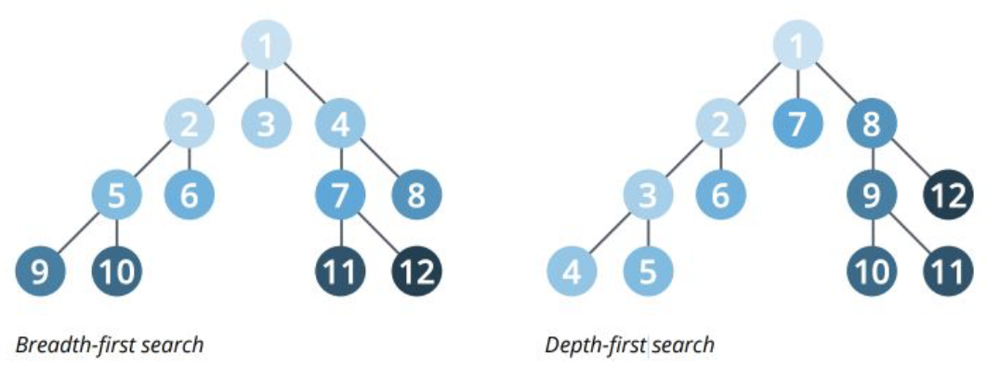
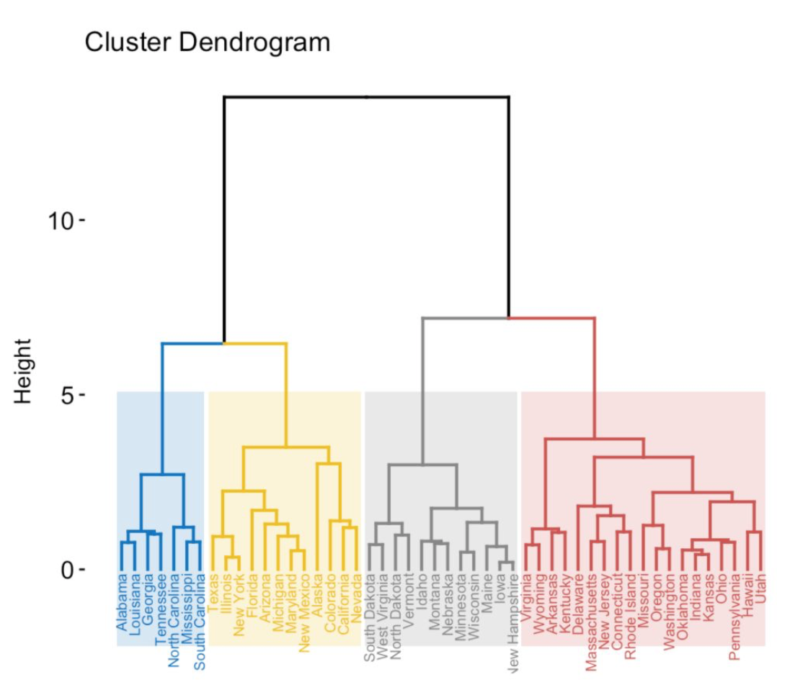
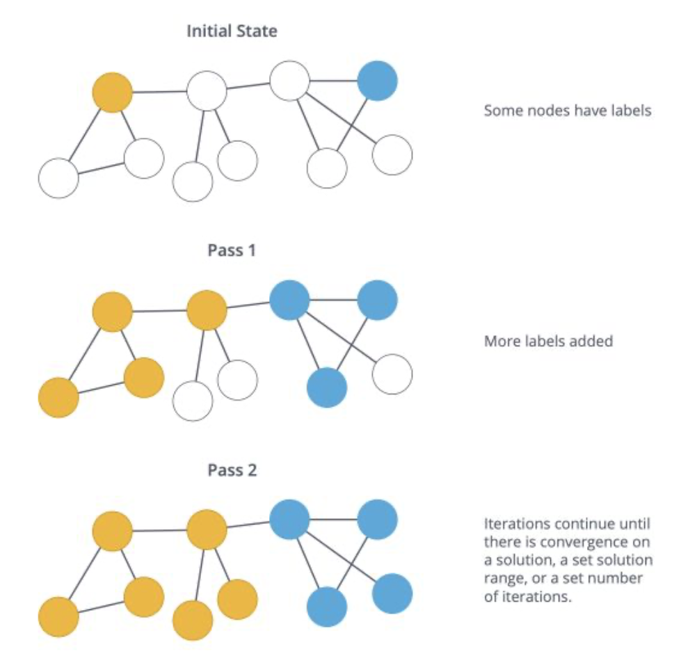
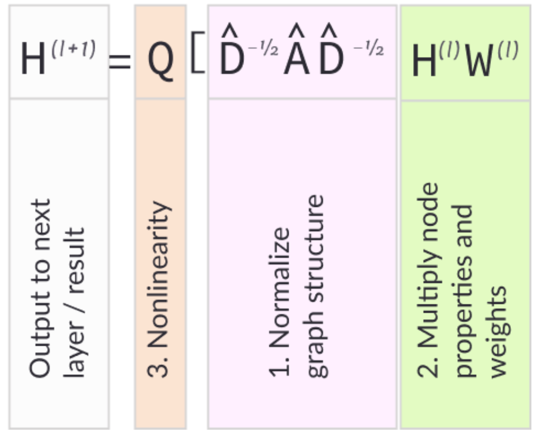

1. [Graph](#Graph)
1. [Graph Neural/Convolutional Network](#GNN)

Essential Notes:
* Graph matching is useful and efficient in finding correspondences;
* GNN is very useful in Zero-Shot Learning when the model needs to recognize and label an image belonging to an unknown class, by inferring which known labels it may be similar to. 

Follow-up:
[ ] Consider use GNN in detecting new objects in the scene???

# Graph
Graph can be used to represent:
* social network
* web pages
* biological networks
* ...

Things that can be learnt from a graph:
* study topology and connectivity
* community detection
* identification of central nodes
* ...

## Basic Notations:
A graph  is made of a set of:
* nodes, a.k.a. vertices, 
* edges 
* An edge  links nodes *i* and *j*. *i* an *j* are said to be neighbors.
* A degree of a node is its number o neighbors.
* A graph is *complete* if every nodes are connected in every possible way. For example, if a graph has n nodes, then it is complete if every nodes have n-1 neighbors.
* A *path* from *i* to *j* is a sequence of edges that goes from *i* to *j*. This path has a length equal to the number of edges.
* The *diameter* of a graph is the length of the LONGEST path among all the shortest path tha link any two nodes.
* The shortest path between two nodes is called the *geodesic* path.
* If all the nodes can be reached from each other by a given path, they form a *connected component*.

Types of Graphs:
* *Connected* if there is only ONE connected component in it.
* *Directed* if edges are ordered pairs. In this case, the degree of a node is classified into "in-degree" and "out-degree" for incoming and outcoming edges respectively.
* *Cyclic* if there are paths through relationships and nodes where you walk from and back to a particular node.
* *Weighted* if there are weights assigned to either nodes or edges.
* *Sparse* if the number of the edges is few compared to the number of nodes. 

Summary:

## Store a Graph:
* as an Edge List, which stores the edge via the pair of nodes;
[(0,1), (0,2), (1,2), (2,0), (2,1)]

* as an Adjacency Matrix;

    * very simple to implement;
    * Space: O(nxn); it wastes lot of memory space. Such matrices are found to be very sparse. For a graph with n vertices and e edges, nxn–e elements in the matrix will be 0.
    * Check if there is an edge between nodes i and j: O(1);
    * Find all edges from a node i: O(n);
    * degree of a vertex can easily be calculated by counting all non-zero entries in the corresponding row of the adjacency matrix.

* as an Adjacency List;
[[0 -> 1 -> 2]
[1 -> 0 -> 2]
[2 -> 1 -> 2]]
    * Space: O(n+m); it is very memory efficient when the graph has a large number of vertices but very few edges.
    * Check if there is an edge between nodes i and j: O(degree(i));
    * Find all edges from a node i: O(degree(i)).
Depending on the usage and available memory, the best representation varies. The graph is usually stored as .txt file.

## Graph Analysis
We analyze a graph at different scales:
* global properties of the network
* communities and clusters
* individual nodes

By exploring the main descriptive measures:
* the degree distribution
* the clustering coefficient
* the small world phenomena
* the centrality of a node
* the diameter of the graph

## Graph Algorithms
1. Graph Search and Path Finding Algorithm
* Search algorithms
    Breadth-First search (BFS) vs. Depth-First search (DFS).
    
* Path finding algorithms
    * Shortest path: computes the shortest weighted path (if the graph is weighted) between a pair of nodes;
    * Single-source shortest path: computes the shortest path from a given node to all other nodes in the graph;
    * All pairs shortest path: computes the shortest path between all pair of nodes;
    * Minimum weight spanning tree: it is a subgraph of the graph (a tree) with a minimum sum of edges weights; A spanning forest is a union of the spanning trees for each connected component of the graph.
2. Community Detection (CLUSTERING)
In this process, the nodes are divided into a set of graphs/clusters according to some certain criterions. Example of usage: Identify social communities, customers behaviors, or web pages topics. A *community* is a set of nodes densely connected internally and/or sparsely connected externally.
* Louvain Modularity (no theoretical guarantee but works well in practice):
* Hierarchical Clustering: build a dendrogram either Bottom-up or Top-down using metrics such as Maximum linkage, Minimum linkage, Average linkage, Centroid linkage.

* Clustering Coefficient: measures how well two nodes tend to cluster together.
3. Centrality Algorithms
* Page Rank Algorithm: Estimates the importance of a current node from its linked neighbors by either iteratively distributing one node's rank over its neighbors or by randomly traversing the graph and counting the frequency of hitting each node during these walks.
* Degree Centrality: Measures the number of incoming and outgoing relationships from a node. It is used to identify the most influential persons on a social network.
* Eigenvector Centrality: represents the number of walks of infinite length ending at node i. This gives more importance to node with well-connected neighbors.
* ...

## Graph Matching
Finds the similarity between two graphs.

Application examples: 
[Correspondences finding using pair-wise constraints](https://www.cs.cmu.edu/~efros/courses/LBMV07/Papers/leordeanu-iccv-05.pdf)

This work takes advantage of the spectral properties of the weighted adjacency matrix M of a graph with nodes for the potential assignments a = (i, i') and weights on edges for the agreements between pairs of potential assignments.

Starting by first finding the level of association of each assignment with the main cluster, by inspecting the eigenvector of M corresponding to its largest eigenvalue (principal eigenvector). 

Then we keep rejecting the assignments of low association, until the constraints on the correspondence mapping are met.

## Graph Learning
* Link Prediction:
Given a graph , the goal is to predict NEW EDGES. (Future relationship or Missing edges).
* Node Labeling:
Given a grpah where some nodes are not labeled, the goal is to predict their labels. Semi-supervised Label Propagation.

## Reference
Graph Learning by maelfabien [Intro](https://maelfabien.github.io/machinelearning/graph_1/) [Analysis](https://maelfabien.github.io/machinelearning/graph_2/) [Algorithm](https://maelfabien.github.io/machinelearning/graph_3/) [Learning](https://maelfabien.github.io/machinelearning/graph_4/)

# GNN
Graph Neural Network (GNN), a.k.a. GCN, performs convolution on a graph. Jus like CNN, it aims to extract th most important nodes and edges that can help classify nodes within the graph.
其本质是分析一张graph network中feature和message的流动和传播。
[Intro to GNN](https://arxiv.org/pdf/2007.02133.pdf)

Convolution operation on a graph:

Then just like CNN, a simple structure example is like:
1. Normalizing the graph structurel
1. Graph convolution layer
1. Leaky ReLU an dropout layers
1. Second graph convolution layer
1. Softmax layer

Example of Applications:
1. Generating Predictions in Physical Systems: Modelling the real-world entities and predict the interactions and future behaviors;
1. _Image Classification_: especially in Zero-Shot Learning when the model needs to recognize and label an image belonging to an unknown class, by inferring which known labels it may be similar to;
1. Community Prediction usin Semi-Supervised Learning;
1. Molecular Structure Analysis
1. Operations Research and Combinarorial Optimization;

## What Can Neural Networks Reason About (ICLR2020)
在 Bellman-Ford 算法求解任意两点间最短路径的问题上，虽然可以证明 MLP 可以表示任何 GNN 可以表示的函数，但 GNN 的泛化能力更强，而后者决定了 GNN 的效果更好，或者说，GNN 学到了如何去推理。究其原因，GNN 可以通过学习一个很简单的步骤，即该算法中的松弛过程，来很好地模拟 Bellman-Ford 算法，而与此相对应地，MLP 却必须去模拟整个 for 循环才可以模拟 Bellman-Ford 算法。

## DropEdge: Towards Deep Graph Convolutional Networks on Node Classification (ICLR2020)
GCNs 在图的很多任务上取得了 SOTA 的表现，如节点分类，社交推荐，关联预测等，而 over-fitting 和 over-smoothing 是两个阻碍 GCNs 在节点分类等任务上进一步发展的问题。

over-fitting 来源于使用一个具有过多参数的模型去拟合一个受限的训练集数据分布，其削弱了模型的泛化能力，而 over-smoothing 则是另一个极端，它指的是因为图卷积操作将一个节点和它邻居的特征向量混合起来，从而在有限步之后所有节点的表示都会收敛到一个相同的值的现象，这同时也会导致梯度消失，直接使得我们无法构建比较深的 GCNs，实际上经典的 GCNs 是比较浅的。受启发于深层的CNNs在图像分类任务上的良好表现，我们也希望探索在节点分类任务上如何可以建构出深层的 GCNs。通过探索这两个阻碍 GCNs 变深的因素---over-fitting 与 over-smoothing，本文提出了 DropEdge，可以同时缓解如上的两个问题，一方面，它可以看做是一种无偏的数据增强方式，通过随机地将原图变形，可以增加输入数据的多样性，从而可以缓解 over-fitting 的现象；另一方面，它可以减少信息在节点间传递，使得节点之间的连接更加稀疏，从而可以一定程度上避免 over-smoothing。
