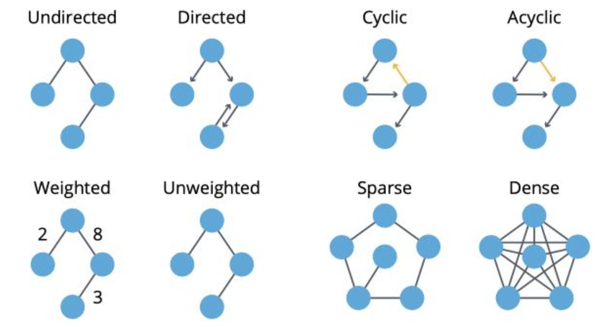

# Graph
Graph can be used to represent:
* social network
* web pages
* biological networks
* ...

Things that can be learnt from a graph:
* study topology and connectivity
* community detection
* identification of central nodes
* ...

## Basic Notations:
A graph  is made of a set of:
* nodes, a.k.a. vertices, 
* edges 
* An edge  links nodes *i* and *j*. *i* an *j* are said to be neighbors.
* A degree of a node is its number o neighbors.
* A graph is *complete* if every nodes are connected in every possible way. For example, if a graph has n nodes, then it is complete if every nodes have n-1 neighbors.
* A *path* from *i* to *j* is a sequence of edges that goes from *i* to *j*. This path has a length equal to the number of edges.
* The *diameter* of a graph is the length of the LONGEST path among all the shortest path tha link any two nodes.
* The shortest path between two nodes is called the *geodesic* path.
* If all the nodes can be reached from each other by a given path, they form a *connected component*.

Types of Graphs:
* *Connected* if there is only ONE connected component in it.
* *Directed* if edges are ordered pairs. In this case, the degree of a node is classified into "in-degree" and "out-degree" for incoming and outcoming edges respectively.
* *Cyclic* if there are paths through relationships and nodes where you walk from and back to a particular node.
* *Weighted* if there are weights assigned to either nodes or edges.
* *Sparse* if the number of the edges is few compared to the number of nodes. 

Summary:

## Store a Graph:
* as an Edge List, which stores the edge via the pair of nodes;
[(0,1), (0,2), (1,2), (2,0), (2,1)]

* as an Adjacency Matrix;

    * very simple to implement;
    * Space: O(nxn); it wastes lot of memory space. Such matrices are found to be very sparse. For a graph with n vertices and e edges, nxn–e elements in the matrix will be 0.
    * Check if there is an edge between nodes i and j: O(1);
    * Find all edges from a node i: O(n);
    * degree of a vertex can easily be calculated by counting all non-zero entries in the corresponding row of the adjacency matrix.

* as an Adjacency List;
[[0 -> 1 -> 2]
[1 -> 0 -> 2]
[2 -> 1 -> 2]]
    * Space: O(n+m); it is very memory efficient when the graph has a large number of vertices but very few edges.
    * Check if there is an edge between nodes i and j: O(degree(i));
    * Find all edges from a node i: O(degree(i)).
Depending on the usage and available memory, the best representation varies. The graph is usually stored as .txt file.

## Graph Convolutional Network (GCN)
GCN的本质：一张graph network中feature和message的流动和传播。
