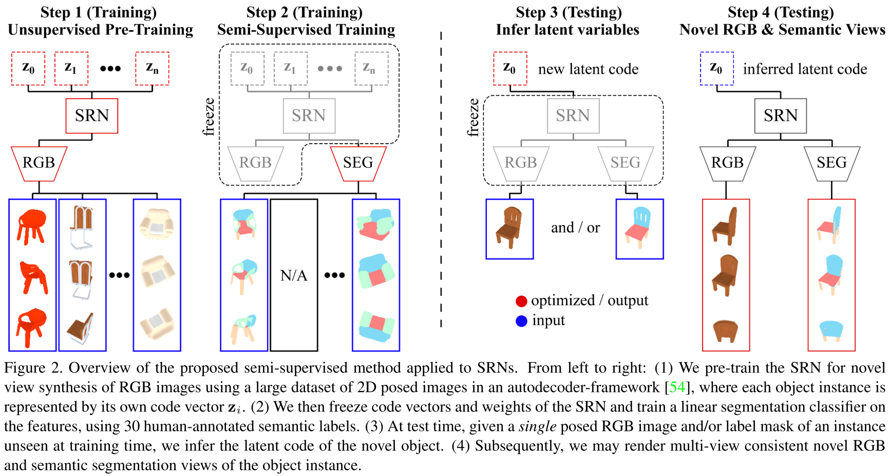

# Table of Content
- [Trending](#trending)
- [Scene Representation Networks NeurIPS2019](#scene-representation-networks)
- [NeRF ECCV2020](#nerf)
- [* Semantic Implicit 3DV2020](#semantic-implicit)
- [* UnsupervisedR&R CVPR2021](#unsupervisedrr)
- [NeruralRecon CVPR2021](#neuralrecon)
- [iMAP ICCV2021](#imap)
- [* Semantic NeRF ICCV2021](#semantic-nerf)
- [* Object-NeRF ICCV2021](#object-nerf)
- [Continual Neural Mapping ICCV2021](#continual-neural-mapping)
- [* Neural RGBD Surface Reconstruction arXiv2021](#neural-rgbd-surface-reconstruction)
- [NeuralBlox 3DV2021][#neuralblox]

# QUESTIONS
1. What does the coordinate-based positional encoding do and how to implement that.

# Trending
*Encoding objects/scenes in the weights of an MLP that directly maps from a 3D spatial location to objects/scenes properties. This MLP serves as an implicit representation of the object/scene.*

**Difference to the "Code" used in the CodeSLAM and its successors**:
1. CodeSLAM use the fixed-length, compact code between encoder and decoder to represent the input while Implicit Represent uses the weights in an MLP to represent the map.
2. CodeSLAM only represent a single RGB or RGB-D frame while Implicit Representation represent the entire map.

**What is an implicit representation**:
In mathematics, an implicit surface is a surface in Euclidean space defined by an equation F(x, y, z) = 0. An implicit surface is the set of zeros of a function of three variables. And implicit means that the equation is not solved for x or y or z. [[Wiki](https://en.wikipedia.org/wiki/Implicit_surface)]

**Example of implicit representation of the shape**:
The signed distance at a location. [paper](https://graphics.stanford.edu/papers/volrange/volrange.pdf) [SDF](../SDF/README.md)

**Neural 3D shape representation**:
- Map xyz coordinates to signed distance functions [[DeepSDF](https://github.com/facebookresearch/DeepSDF)], [[Local Implicit Grid](https://github.com/tensorflow/graphics/tree/master/tensorflow_graphics/projects/local_implicit_grid)] or occupancy fields [[Occupancy Network](https://github.com/autonomousvision/occupancy_networks)], [[LDIF](https://github.com/google/ldif)]. GOUND TRUTH 3D GEOMETRY REQUIRED FOR TRAINING. Limited to simple shapes with low geometric complexity.

[Back Top](#table-of-content)

# NeRF
General Idea and how the scene is represented understood.
STILL FUZZY ABOUT HOW THE MATH WORKS IN RENDERING THE SCENE USING NETWORK OUTPUTS (c, σ), as well as why the special design helps.
LOOK INTO SEMINAL RAY TRACING WORKS.

GOAL: new view sythesis.

Main Advantage: It overcomes the prohibitive storage costs of discretized voxel grids when modeling complex scenes at high-resolutions.

Novelty: 
1) Add the additional 2D view dependent appearance to the 3D volumes, making it a 5D radiance field. 

To render the *neural radince field* (NeRF) from a particular viewpoint:
1) march camera rays through the scene to generate a sampled seto fo 3D points;
2) use those points and their corresponding 2D viewing directions as input to the MLP to produce set of colours and densities;
3) use classical volume rendering techinques to accumulate those colours and densities into a 2D image.

By applying gradient descent on minimising error between each observed image and the corresponding rendered view across multiple views, the network is encouraged to predict a coherent model of the scene by assigning high volume densities and accurate colours to the locations that actually contain the scene content.

#### Modeling the scene as a neural radiance field
Network Input: 3D location **x** = (x, y, z) and 2D viewing direction (θ, φ) (expressed as 3D cartisan unit vector **d**);
Network Output: Colour **c** = (r, g, b) and volume density σ.
Then the scene is repreesented by the MLP as: F_Θ: (**x**, **d**) -> (**c**, σ) and optimise the weights Θ to map each input to its cooresponding output.

FIRST, the MLP F_Θ processes the input 3D coordinate **x** with 8 FC layers (using ReLU activations and 256 channels per layer), and outputs σ and a 256-dimensional feature vector. 
THEN, this feature vector is concatenated with the camera ray’s viewing direction **d** and passed to one additional FC layer (using a ReLU activation and 128 channels) that output the view-dependent RGB colour **c**.

#### Rendering novel views from this representation
Colour of the scene is rendered following [classical volume rendering](https://dl.acm.org/doi/10.1145/964965.808594)
The volume density σ(**x**) can be interpreted as the differential probability of a ray terminating at an infinitesimal particle at location x.
The function T(t) denotes the accumulated transmittance along the ray from tn to t, i.e., the probability that the ray travels from tn to t without hitting any other particle.

#### Optimisation
##### Positional encoding
Mapping the inputs to a higher dimensional space using high frequency functions to enable our MLP to more easily approximate a higher frequency function.
A similar mapping is used in the popular [Transformer](https://proceedings.neurips.cc/paper/2017/file/3f5ee243547dee91fbd053c1c4a845aa-Paper.pdf) architecture, where it is referred to as a positional encoding
##### Hierarchical volume sampling
Simultaneously optimize two networks: one “coarse” and one “fine.

[Back Top](#table-of-content)

# iMAP

With RGB-D input, iMAP uses a MLP to represent the 3D volumetric map and casts the SLAM as a **Continual Learning** problem. The catastrophic forgetting is alleviated with replaying. Keyframes are selected to store and compress past memories. 

#### Implicit Network
A 3D volumetric map is represented using a fully-connected neural network Fθ that maps a 3D coordinate to colour and volume density.

Following [NeRF](#nerf), an MLP with 4 hidden layers of feature size 256 is used. The MLP takes in 3D coordinates **p** = (x, y, z) and outputs colour **c** = (r, g, b) and volulme density ρ. i.e. F_θ(**p**) = (**c**, ρ).

Difference to NeRF, the 2D viewing directions are ignored as the directions are mainly for modelling specularities in generating new views while iMAP is not interested in that in a SLAM setup.

Gaussian positional embedding proposed in Fourier Feature Networks [32] to lift the input 3D coordinate into n-dimensional space

#### Rendering
?? Why the inter-sample distance followed by activation can be used as occupancy probability?????

Given a camera pose, we can render the colour and depth of a pixel by accumulating network queries from samples in a back-projected ray.

Given a camera pose T_WC and a pixel coordinate (u, v):
1. Back-project a normalised viewing direction and transform it into world coordinates: **r** = T_WC K^-1 (u,v) with camera intrinsic matrix K.
2. Take a set of N samples along the ray **p**_i = d_i **r** with corresponding depth values {d_1, ..., d_N}. (following NeRF's sampling strategies.)
3. For each **p**_i, get the network prediction (**c**_i, ρ_i) = F_θ(**p**_i)
4. Transform the volume density into an occupancy probability by Multiplying the inter-sample distance δ_i = d_i+1 - d_i and passing this through activation function o_i = 1 - exp(- ρ_i δ_i)
5. Calculate the ray termination probability at each sample **p**_i as w_i = o_i TT_j=1^i-1(1-o_j)
6. Render the colour and depth as the expectations: D[u,v] = Sum_i=1^N w_i d_i, I[u,v] = Sum_i=1^N w_i **c**_i.
7. Depth variance is calculated as: D_var[u,v] = Sum_i=1^N w_i (D[u,v] - d_i)^2.

#### Optimising
The network weights and camera poses are optimised incrementally w.r.t. a sparse set of actively sampled measurements.

##### Tracking
Optimise the pose of current frame w.r.t. the locked network.

Photometric loss: L1_norm between the rendered and hte measured colours.
e_i^p[u,v] = | I_i[u,v] - I'_i[u,v] | Average over all pixels.

Geometric Loss: e_i^g[u,v] = | D_i[u,v] - D'_i[u,v] | Normalised average over all pixels with the depth variancce as the normalisation factor.

Adam optimiser on the weighted sum L_geom + λ_photo L_photo.

##### Mapping
Jointly optimise the network and the camera poses of selected keyframes, which are incrementally chosen based on information gain.

**An obivious question here is: is there any upper limits on how many keframes can be stored? i.e. can this method handle large scale scenes???**

*Limitation raised by [[NeuralBlox](#neuralblox)]: iMAP has limited scalability as the entire scene is represented in one single code*

[Back Top](#table-of-content)

# UnsupervisedR&R

An end-to-end unsupervised approach to learn point cloud registration from raw RGB-D video by leveraging differentiable alignment and rendering to enforce photometric and geometric consistency between frames.

Key Idea: use the natural transformations in the data as indirect supervision provided in the RGB-D video.

Trained relying on consistency loss instead of pose supervision.

General Approach:
1. first extract 2D features for each image and project them into two feature point clouds; 
2. extract correspondences between the two point clouds and rank the correspondences based on their uniqueness.
3. use a differentiable optimizer to align the top k correspondences and estimate the 6-DOF transformation between them.
4. render the point cloud from the two estimated viewpoints to generate an RGB image for each view; and use photometric and geometric consistency losses between the RGB-D inputs and outputs and back-propagate through our entire pipeline.

#### Point Cloud Generation
I \in R^{4xHxW} -> P \in R^{(6+F)xN}.
4 channels in the input image are R, G, B, D;
p \in P is represented by a 3D coordinate **x**_p \in R^3, a colour **c**_p \in R^3, and a feature vector **f**_p \in R^F.

3D points are generated with back-project and pixels with missing depth measurements are omitted.

Features are extracted using an encoder, and the feature map has the same spatial resolution as the input image.

#### Correspondences Estimation
Consice distance is used to determine the closest features. Leading to two sets of correspondences C_{P->Q} and C_{Q->P}.
To estimate a weight for each correspondence, Lowe's ratio test is applied. Computed as the distance between p to its 1st nearest neighbour q_p1 over the distance between p to its 2nd nearest neighbour q_p2.
Final correspondence set is M = {(p, q, w)_i: 0 <= i < k} where k = 400.

#### Geometric Fitting
Given the set of correspondences M, solve for the optimal transformation T* over an error function. Solved with a weighted variant of Kabsch's algorithm.
A simplified version of RANSAC is also applied to mitigate the problem of outliers.

#### Point Cloud Rendering
Render the RGB-D images from the aligned point clouds serving a verificaiton step.
If the camera locations are estimated correctly, the point cloud renders will be consistent with the input images

## Possible Improvement
Work on large viewpoint changes

[Back Top](#table-of-content)

# Continual Neural Mapping

GOAL: continual learn the implicit scene representation directly from sequential observations.
Bridging the gap between batch-trained implicit neural representations and streaming data.

Casted as **Continual Learning** problem, as [iMap](#imap).

## Problem Statement
**y** = f(**x**, θ^t), \all **x** \in W. The goal is to learn the mapping function f(-) parameterised by a neural network θ^t. W is the 3D environment, **x**^t \in Ω^t \subset W is the 3D coordinate at time t, and **y** is the scene property.

**Knowledge Transfer**
- Backward Transfer: [[Continual Learning for Robotics](https://arxiv.org/pdf/1907.00182.pdf)] [[Gradient Episodic Memory](https://arxiv.org/pdf/1706.08840.pdf)]
For unvisited areas, the mapping function f(-) can be queried at any time to predict hte scene property **y** given the spatial cooridinate **x**.
For previsouly visited area **x** \in Ω^{1:t}, the mapping funciton f(-) serves as a compact memory of past observations D^{1:t}.
- Forward Transfer:
May be facilitated that distills knowlege and skills for *future exploration*.

**Learning Paradigms**
Domain-incremental continual learning: data distribution shifts and the objective remains the same.

- Multi-task learning: splits the training process into a set of dependent tasks and optimizes all tasks jointly. The network is fixed once the model is deployed.
- Fine-tuning: maintains a single network consecutively, where network parameters of a new task are initialized with that of the last task. The performance of early tasks will degrade on current network parameters (*Catastrophic Forgetting*).
- Batch-retraining: preserves all previously observed data to satisfy the iid-sampled assumption. It is computationally expensive as it learns a new model at each time from scratch without exploiting past experience.

[Back Top](#table-of-content)

# NeuralRecon

GOAL: Directly reconstruct local surfaces represented as sparse TSDF volumes for each video fragment.
**Gated Recurrent Units** are used here for the learning-based TSDF fusion module. 
*This work fomulated the SLAM problem differently to [iMAP](#imap) or [Continual Neural Mapping](#continual-neural-mapping). Instead of using the Continual Learning Formulation with a single MLP, NerualRecon adops a CNN-RNN-MLP formulation.*

Input: Monocular images with corresponding camera poses.
Unprojects the image features to form a 3D feature volume and then uses sparse convolutions to process the feature volume to output a sparse TSDF volume.
GRU makes ccurrent reconstruction conditioned on previous global volume.
Speed: 33 keyframes per second on an NVIDIA RTX 2080Ti GPU.

- Keyframe images passed through iamge backbone to extract multi-level features;
- Backproject the features and aggregated them into a 3D feature volume F_t^l;
- 3D feature volume F_t^l is passed through the GRU and MLP modules to get the predicted Sparse TSDF (Final Output).

[Back Top](#table-of-content)

# Neural RGBD Surface Reconstruction

**Reference to network structure here**

TL;DR: Replacing the mapping module in BundleFusion with the network and optimisation proposed in this paper.

Leverages the success of implicit novel view synthesis ([NeRF](#nerf)) for surface reconstruction.
Incorporate **depth measurement** into the radiance field formulation to produce mroe detailed and complete reconstruction.

Again, use a deep neural network to store the TSDF. And the beneficial is the same as previous ones, i.e. handling regions with missing depth measurements.

<u> Good review on representing scenes in the weights of a MLP (compensation to the papers mentioned here). </u>

General Steps:
1. Initialisation: obtain camera pose using BundleFusion.
1. Optimisation: optimise a continuous volulmetric representation of the scene that stores radiance and TSDF per point.
1. Evaluation: use Marching Cubes to extract a triangle mesh.

MLP-1:  
Input:  encoding (represented by γ(-)) of a queried 3D point;
Output: the truncated signed distance D_i to the nearest surface (TSDF value).
MLP-2: 
produce surface colour valules for a given viewing direction d.
Input: concatenation of 1) positional encoding of the viewing direction γ(d) (enables dealing with view-dependent effects like specular highlights); 2) a 2-D appearance latent code (learned for each frame following [NeRF in the Wild](https://nerf-w.github.io/) to correct for effects like auto-white balancing); 3) the output of MLP-1.
Output: colour value of the given pixel.

[Back Top](#table-of-content)

# Scene Representation Networks

A less direct neural 3D representation: 1) outputs a feature vector and RGB colour at each continueous 3D coordinates; 2) proposes a differentiable rendering function consisting of a recurrent neural network that marches along each ray and decide where the surface is located.

[Back Top](#table-of-content)

# Semantic Implicit

Build on Scene Representation Networks ([SRN](#scene-representation-networks)) and perform per-point semantic segmentation in addition to represent appearance and geometry.
The model proposed in this paper is a **Semantically Aware Implicit Neural Scene Representation**.

<u>Good review on representing scenes in the weights of a MLP (compensation to the papers mentioned here). </u>

Small set of semantically labelled data is needed for training.

## Methodology

#### SRN

*SRN*: Encode a scene in the weights **w** \in R^l of a MLP. Map a 3D coordinate **x** to a scene property **v**.

*RGB Renderer*: 1) use a differentiable ray marcher to find the intersections of camera rays withscene geometry; 2) query the SRN at the intersection points and map the feature vector **v** to an RGB colour using another MLP.

*Hypernetwork*: maps the embedding vector **z** \in R^k to the weight **w** \in R^j, enabling representing an object class using an embedding vector **z**.

#### Semantic

Minimum supervision wanted, authors concludes that the learned features **v** already contains the semantic info (see t-SNE plot).

*Segmentation Render SEG*: Maps a feature vector **v** to a distribution over class labels **y**.
SEG is added to the SRN in parrallel to the RGB Renderer.

SEG is parameterised as a linear classifier with input being the feature vector **v** from SRN and output being class labels.

[Back Top](#table-of-content)

# Semantic-NeRF
### In-Place Scene Labelling and Understanding

Advantages of using implicit neural reconstructions is that they do not require prior training data. But the fully self-supervised approach is not possible for semantics (labels are human-defined).

*Main achievement*: **extend [NeRF](#nerf) to jointly encode semantics with appearance and geometry**.

*Goal*: focused on solving semantic segmentation with sparse and very noisy labels, with applications in **Visual Semantic Mapping Systems** like scene labelling, novel semantic view synthesis, label interpolation, multi-vew semantic label fusion.

Therefore, a **Scene-Specific** network is designed for <u> joint geometric and semantic prediction </u> and train it on images from a **Single Scene** with only *weak semantic supervision and no geometric supervision*. 

<u> Good review on comparing code-based representations with the implicit 3D representations. </u>

Input: a set of RGB images with associated known camera poses and some partial/noisy semantic labels.
Output: implicit 3D representations of both geometry and semantics for the whole scene.

*Semantic Segmentation Renderer*: appended to the NeRF before the injection of viewing directions. It is formalised as an inherently view-independent function that maps only a world coordinate **x** to a distribution over C semantic classes via softmax. 
The estimated semantic label given 3D points from a ray is very similiar to the formulation of colour estimation.

The training loss for the entire network is a weighted sum of photometric loss L_p and semantic loss L_s.

The network is trained for **each scene individually**, i.e. train and tested on the same sequences but different frames.

Training images (colour, depth, semantic) are generated using [Habitat](../Tools/README.md)

[Back Top](#table-of-content)

# Object-NeRF

Goal: editable scene rendering.
Drawback of NeRF: Encode the entire scene as a whole and is not aware of the object identity.
Input: posed images and 2D instance masks. 

<u> Good review on object decomposite rendering. </u>

Input: 
Hybrid space embedding: apply positional endocing γ(·) ([NeRF](#nerf)) on both of the scene voxel feature **f**_{scn} and the space coordinate **x**.
Direction embedding: γ(**d**).
Input only to the object brance: embedde object voxel features: γ(**f**_{obj}) and object activation code: **l**_{obj}.
* **f**_{obj} helps to broaden the ability of learning decomposition and is shared by all the objects and **l**_{obj} identifies feature space for different objects and is possessedby each individual. *

Output:
Scene branch: the opacity σ_{scn} and colour **c**_{scn} of the scene at **x**.
Object branch: color **c**_{obj} and opacity **σ**_{obj} for the desired object while everything elseremains empty.

Q: what is the activation code and how to get the voxel features. Answered below.

Object-composition:
Supervision is achieved with 2D instance segmentation and assigning a bunch of shuffled object activation codes to the training rays.
Assuming there are K annotated objects in the scene, create a learnable object code library L={**l**_{obj}^k}.
For each ray **r**, select one object k as a training target and assign the object activation code **l**_{obj}^k to the object branch input.
Colour output **c**_{obj} and opacity output **σ**_{obj} is computed in the same way as colour and opacity in NeRF.
The loss of object supervision considers the distance between instance masks and also the distance between the rendered colour and the masked ground-truth colour.

[Back Top](#table-of-content)

# NeuralBlox

**This work feels like more related to CodeSLAM style rather than NeRF**

Incrementally build and update the neural implicit representations.
The scene of arbitrary size is represented as a dynamically growing grid of voxels with latent codes in them and updates are performed directly in the latent space.
Real-time performance on CPU.

[Back Top](#table-of-content)
