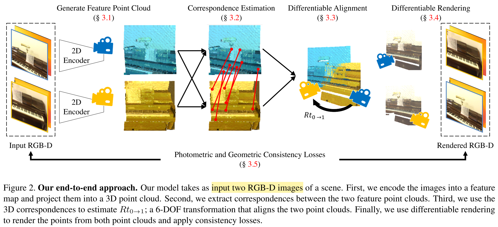

# UnsupervisedR&R

## Table of Content
- [Overview](#conceptual-overivew)
- [Architecture](#network-architecture)

## Conceptual Overview 
Questions aim to be answered:
(1) does unsupervised training provide us with useful features for alignment?; 
(2) can RGB-D video alleviate the need for the pose supervision required by ge- ometric registration approaches?; 
(3) how do the different components of the model contribute to its performance?

An end-to-end unsupervised approach to learn point cloud registration from raw RGB-D video by leveraging differentiable alignment and rendering to enforce photometric and geometric consistency between frames.

Key Idea: use the natural transformations in the data as indirect supervision provided in the RGB-D video.

Trained relying on consistency loss instead of pose supervision.

General Approach:
1. first extract 2D features for each image and project them into two feature point clouds; 
2. extract correspondences between the two point clouds and rank the correspondences based on their uniqueness.
3. use a differentiable optimizer to align the top k correspondences and estimate the 6-DOF transformation between them.
4. render the point cloud from the two estimated viewpoints to generate an RGB image for each view; and use photometric and geometric consistency losses between the RGB-D inputs and outputs and back-propagate through our entire pipeline.



#### Point Cloud Generation
[implementation](#data-flow-in-a-forward-pass)
I \in R^{4xHxW} -> P \in R^{(6+F)xN}.
4 channels in the input image are R, G, B, D;
p \in P is represented by a 3D coordinate **x**_p \in R^3, a colour **c**_p \in R^3, and a feature vector **f**_p \in R^F.

3D points are generated with back-project and pixels with missing depth measurements are omitted.

Features are extracted using an encoder, and the feature map has the same spatial resolution as the input image.

#### Correspondences Estimation
[implementation](#data-flow-in-a-forward-pass)
Consice distance is used to determine the closest features. Leading to two sets of correspondences C_{P->Q} and C_{Q->P}.
To estimate a weight for each correspondence, Lowe's ratio test is applied. Computed as the distance between p to its 1st nearest neighbour q_p1 over the distance between p to its 2nd nearest neighbour q_p2.
Final correspondence set is M = {(p, q, w)_i: 0 <= i < k} where k = 400.

#### Geometric Fitting
[implementation](#data-flow-in-a-forward-pass)
Given the set of correspondences M, solve for the optimal transformation T* over an error function. Solved with a weighted variant of Kabsch's algorithm.
A simplified version of RANSAC is also applied to mitigate the problem of outliers. Details refer to [Choy et al. CVPR2020](https://github.com/chrischoy/DeepGlobalRegistration) and [Kabsch's Algorithm ](https://onlinelibrary.wiley.com/doi/abs/10.1107/S0567739476001873?sentby=iucr).

#### Point Cloud Rendering
[implementation](#data-flow-in-a-forward-pass)
**This step provides the primary learning signals: photometric and depth consistency.**
Render the RGB-D images from the aligned point clouds serving a verificaiton step.
If the camera locations are estimated correctly, the point cloud renders will be consistent with the input images

#### Loss design
We use three consistency losses to train our model: photometric, depth, and correspondence. 
The photometric and depth losses are the L1 losses applied between the rendered and input RGB-D frames. Those losses are masked to only apply to valid pixels
Additionally, we use the correspondence error calculated in Eq. 4 (error when computing alignment) as our correspondence loss. 
We weight the photometric and depth losses with a weighting of 1 while the correspondence loss receives a weighting of 0.1.

#### Possible Improvement
Work on large viewpoint changes

[[Back to Top]](#table-of-content)


## Network Architecture
The model consists of three main components: an *Encoder*, a *Decoder* and a *Renderer*.
### 2D Encoder
ResNetEncoder has a 4-layer architecture:
```python
resnet = resnet18(pretrained=pretrained)
inconv = ConvBlock(chan_in, 64, k=3)
layer1 = resnet.layer1
layer2 = resnet.layer1
outconv = ConvBlock(64, chan_out, k=1, activation=False)
```

inconv: `ConvBlock` consists of Conv -> BN -> ReLU with input being the RGB image (3, 128, 128). Conv uses conv3x3 (the 3x3 convolution with padding) from `torchvision.models.resnet`, BN = nn.BatchNorm2d(), ReLU = nn.ReLU().
Outputs a feature map of size (64, 128, 128).

!!!??? NO DOWNSAMPLING

layer1: `resnet.layer1` is the second convolutional block in the ResNet18, which is made of [conv3x3 * 2] *2.
Outputs a feature map of size (64, 128, 128).

layer2: exactly the same architecture as layer1.
Outputs a feature map of size (64, 128, 128).

outconv: same architecutre as inconv except that the Conv uses conv1x1 rather than conv3x3.
Outputs a feature map of size (32, 128, 128).

### 2D Decoder
ResNetDecoder also has a 4-layer architecture
```python
resnet = resnet18(pretrained=pretrained)
resnet.inplanes = chan_in
layer1 = resnet._make_layer(BasicBlock, 64, 2)
resnet.inplanes = 64
layer2 = resnet._make_layer(BasicBlock, 64, 2)
upconv1 = UpConv(64, 64, "bilinear")
outconv = ConvBlock(64, chan_out, batchnorm=False, activation=False)
```
layer1: is made with `_make_layer()` function from `torchvision.models.resnet`. It consists of 2 blocks of BasicBlock from ResNet and the output feature size is 64.

layer2: exactly the same as layer1.

upconv1: keep feature size the same and perform upsampling with scale=2.

outconv: same as layer_0 from encoder, with different input, output feature size.

### Points Renerer
``rasterize_points`` from ``pytorch3d.renderer.points`` is used to render a batch of points. The PointRenderer class combines rasterisation, weight calculation, and compisiting.

Rasterizing settings:
```python
S = render_cfg.render_size
K = render_cfg.points_per_pixel
# convert radius from pixels to normalised device coordinate (NDC)
r = 2 * render_cfg.radius / float(render_cfg.render_size)
```

Define weight computation:
```python
if render_cfg.weight_calculation == "linear":
    calculate_weights = linear_alpha
elif render_cfg.weight_calculation == "exponential":
    calculate_weights = exponential_alpha
else:
    raise ValueError()
```

Define compositing:
```python
if render_cfg.compositor == "alpha":
    compositor = compositing.alpha_composite
elif render_cfg.compositor == "weighted_sum":
    compositor = compositing.weighted_sum
elif render_cfg.compositor == "norm_weighted_sum":
    compositor = compositing.norm_weighted_sum
else:
    raise ValueError()
```

Then when doing a forward pass given input points and features (both in FloatTensor with size BxNx3 and BxNxF).

Rasterise the points:
```python
pointcloud = pytorch3d.structures.Pointclouds(points, features=features)
```
([Official Docs](https://pytorch3d.readthedocs.io/en/latest/modules/structures.html) and [Source Code](https://pytorch3d.readthedocs.io/en/latest/_modules/pytorch3d/structures/pointclouds.html#Pointclouds)).

```python
idx, zbuf, dist_xy = rasterize_points(pointcloud, S, r, K)
```
([Source Code](https://github.com/facebookresearch/pytorch3d/blob/v0.6.0/pytorch3d/renderer/points/rasterize_points.py)). 

The 4 input arguments are: 

- a Pointclouds object representing a batch of point cloud to be rasterised, 
- size of the output (square) image to be rasterised, 
- the radius (in NDC units) of the disk to be rasterised, 
- the number of points per pixel.

The 3 outputs are:

- idx: int32 Tensor of shape (N, image_size, image_size, points_per_pixel) giving the **indices of the nearest points at each pixel**, in ascending z-order. Concretely `idx[n, y, x, k] = p` means that `points[p]` is the kth closest point (along the z-direction) to pixel (y, x) - note that points represents the packed points of shape (P, 3). *Pixels that are hit by fewer than points_per_pixel are padded with -1.*
- zbuf: Tensor of shape (N, image_size, image_size, points_per_pixel) giving the **z-coordinates of the nearest points at each pixel**, sorted in z-order. Concretely, if `idx[n, y, x, k] = p` then `zbuf[n, y, x, k] = points[n, p, 2]`. *Pixels that are hit by fewer than points_per_pixel are padded with -1.*
- dist_xy: Tensor of shape (N, image_size, image_size, points_per_pixel) giving the **squared Euclidean distance (in NDC units) in the x/y plane** for each point closest to the pixel. Concretely if `idx[n, y, x, k] = p` then `dists[n, y, x, k]` is the squared distance between the pixel (y, x) and the point `(points[n, p, 0], points[n, p, 1])`. *Pixels that are hit by fewer than points_per_pixel are padded with -1.*

Prepare for rasterising:
```python
# Calculate PC coverage
valid_pts = (idx >= 0).float()      # same shape with values being 0 or 1
valid_ray = valid_pts[:, :, :, 0]   # get the closest point (along z-axis) to pixel (x, y)

# Calculate composite weights -- dist_xy is squared distance!!
weights = calculate_weights(dist_xy, r)
weights = weights.clamp(min=0.0, max=0.99)  # Clamp weights to avoid 0 gradients or errors

# change dim order for idx
idx = idx.long().permute(0, 3, 1, 2).contiguous()
```

Rasterising:
```python
# features
feats = pointcloud.features_packed().permute(1, 0)
feats = compositor(idx, weights, feats)

# depth
# zero out weights -- currently applies norm_weighted sum
w_normed = weights * (idx >= 0).float()
w_normed = w_normed / w_normed.sum(dim=1, keepdim=True).clamp(min=1e-9)
depth = zbuf.permute(0, 3, 1, 2).contiguous() * w_normed.contiguous()
depth = depth.sum(dim=1, keepdim=True)
```

### Data flow in a forward pass
Use the *Encoder* to get features for each input view:
```python
feats = [self.encode(rgbs[i]) for i in range(n_views)]
```

Generate the point clouds from an evenlly spaced grid, given RGB-D inputs [link](#point-cloud-generation):
```python
B, _, H, W = feats[0].shape
assert feats[0].shape[-1] == deps[0].shape[-1], "Same size"
grid = get_grid(B, H, W)
grid = grid.to(deps[0])

K_inv = K.inverse()
pointclouds = [
    grid_to_pointcloud(K_inv, deps[i], feats[i], grid) for i in range(n_views)
]
pcs_X = [pc[0] for pc in pointclouds]
pcs_F = [pc[1] for pc in pointclouds]
```

Get the correspondences given the features from views using kNN according to a distance metric (default cosine distance) [link](#correspondences-estimation):
```python
corr_i = get_correspondences(
    P1=pcs_F[0], P2=pcs_F[i], P1_X=pcs_X[0], P2_X=pcs_X[i],
    num_corres=self.num_corres, ratio_test=(self.align_cfg.base_weight == "nn_ratio"),
)
```

Align the two point clouds given estimated correspondences by randomly choose N subsets and selects the one that minimises the chamfer distance [link](#geometric-fitting):
```python
Rt_i, cor_loss_i = align(corr_i, pcs_X[0], pcs_X[i], self.align_cfg)
```

For every view, get the point clouds, features and RGBs from all other views (in world coordinate system), then render the joint point cloud with colour and feature [link](#point-cloud-rendering):
```python
for i in range(n_views):
    if self.pointcloud_source == "other":
        # get joint for all values except the one
        pcs_X_joint = torch.cat(pcs_X[0:i] + pcs_X[i + 1 : n_views], dim=1)
        pcs_F_joint = torch.cat(pcs_F[0:i] + pcs_F[i + 1 : n_views], dim=1)
        pcs_RGB_joint = torch.cat(
            pcs_rgb[0:i] + pcs_rgb[i + 1 : n_views], dim=1
        )
        pcs_FRGB_joint = torch.cat((pcs_F_joint, pcs_RGB_joint), dim=2)

    if i > 0:
        rot_joint_X = transform_points_Rt(pcs_X_joint, vps[i - 1])  # transform back to world coordinate system
        rot_joint_X = points_to_ndc(rot_joint_X, K, (H, W))
    else:
        rot_joint_X = points_to_ndc(pcs_X_joint, K, (H, W))
    projs.append(self.renderer(rot_joint_X, pcs_FRGB_joint))
```

Decode the features to get a decoded RGB:
```python
for i in range(n_views):
    proj_FRGB_i = projs[i]["feats"]
    proj_RGB_i = proj_FRGB_i[:, -3:]
    proj_F_i = proj_FRGB_i[:, :-3]

    output[f"rgb_decode_{i}"] = self.decode(proj_F_i)
```

Output summary:
```python
# estimated correspondences
output[f"corres_0{i}"] = corr_i
output[f"vp_{i}"] = Rt_i
output["corr_loss"] = sum(cor_loss)
# aligned pcd
pcs_X_rot = [
    transform_points_Rt(pcs_X[i + 1], vps[i], inverse=True) for i in range(n_views - 1)
]
pcs_X = pcs_X[0:1] + pcs_X_rot
output["joint_pointcloud"] = torch.cat(pcs_X, dim=1).detach().cpu()
# decode
output[f"rgb_decode_{i}"] = self.decode(proj_F_i)
# render
output[f"rgb_render_{i}"] = proj_RGB_i
output[f"ras_depth_{i}"] = projs[i]["depth"]
output[f"cover_{i}"] = projs[i]["mask"].unsqueeze(1)
```

#### Loss
*Loss = Appearance_Loss + Depth_Loss + 0.1 * Correspondence_Loss*
where appearance_loss and depth_loss are calculated between the input view and the rendered view while the correspondence_loss is computed in the kNN-alignment stage.


[[Back to Top]](#table-of-content)
