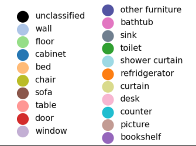
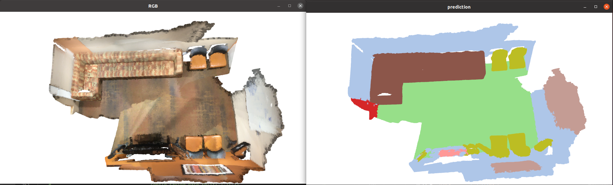
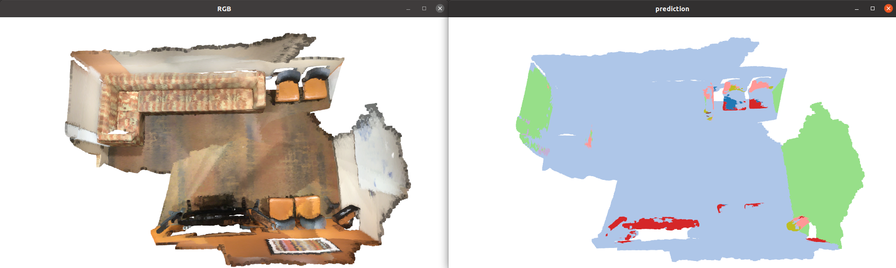

# SCANNET dataset (ClougSeg)

## Observations


The test model is trained with only *vertical* rotation augmentation only.

Results with unchanged input point cloud.


Results after rotating the input point cloud along y-axis for 90 degrees.

Although the input points coordinates are centered at the selected center point (as said [here](#neighbors-of-center-point)), horizontal planar patches and vertical planar patches can still be separated by looking at the changes in the local coordinates. Then horizontal planar patches are tend to classified as floors (green) and vertical planar patches are tend to classified as walls (blue).


## Containers To Get Network Input
`self.input_trees` stores a list of KD-Trees, generated from SUB-SAMPLED point cloud and used for ..., SUB-SAMPLED points are also sotred in the Trees;
Q: What does the KD-Tree do?

`self.input_colors` stores the RGB values for every 3D points in the SUB-SAMPLED point cloud;

`self.input_vert_inds` stores the map from SUB-SAMPLED point cloud to the ORIGINAL point cloud, i.e. for evey subsampled point, a map stores the index of the corresponding original point;

`self.input_labels`, for Training and Validation only, stores the semantic label for every 3D points in the SUB-SAMPLED point cloud;

`self.pot_trees` stores a list of coarser KD-Trees, generated from SUB-SUB-SAMPLED point cloud and used for ..., SUB-SUB-SAMPLED points are also sotred in the Trees;
Q: What does the coarser KD-Tree do?
A: Used to better find the input center points.

`self.validation_labels` stores the ground truth label of the validation point cloud, in the same dimension as the number of the ORIGINAL point cloud;

`self.test_proj` stores a list of indices which maps every point in the ORIGINAL point cloud to its closet point in the SUB-SAMPLED point cloud. 
`self.test_proj` is NOT exactly the inverse mapping of `self.input_vert_inds`. Some original ponts are mapped to a different subsampled point rather than the one it generates.

Following 3 are all in the same length as the pot_trees:
`self.potentials` stores the full potentials values (each SUB-SUB-SAMPLED point is assigned with a potential number);
`self.min_potentials` stores teh minimum potential values for each pot_tree;
`self.argmin_potentials` stores the index of minimum potential value for each pot tree.

<!-- self.num_clouds = 0 -->

## Network Inputs

Example input list see example_batch_data.txt in dataset folder

[Points](#data-augmentation) coordinates (centered at selected center point) in each layer
```python
# eg. [21604, 3], [5473, 3], [1392, 3], [335, 3], [86, 3]
self.points = [torch.from_numpy(nparray) for nparray in input_list[ind:ind+L]]
```
[Neighbors Indices](#convolution-neighbors) (indices in Points array above) in each layer for convolution
```python
# eg. [21604, 63], [5473, 61], [1392, 397], [335, 277], [86, 86]
self.neighbors = [torch.from_numpy(nparray) for nparray in input_list[ind:ind+L]]
```
[Pooling/Upsampling Indices](#pooling-upsampling)
```python
# eg. [5473, 58], [1392, 57], [335, 394], [86, 273], [0, 1]
self.pools = [torch.from_numpy(nparray) for nparray in input_list[ind:ind+L]]
# eg. [21604, 62], [5473, 60], [1392, 281], [335, 86], [0, 1]
self.upsamples = [torch.from_numpy(nparray) for nparray in input_list[ind:ind+L]]
```

[Number of Points](#data-augmentation) in each layer
```python
# eg. [21604, 5473, 1392, 335, 86]
self.lengths = [torch.from_numpy(nparray) for nparray in input_list[ind:ind+L]]
```

[Input Features](#input-features)
```python
# dim = [21604, 4], val = [1, r, g, b]
self.features = torch.from_numpy(input_list[ind])
```

[Semantic Labels](#neighbors-of-center-point) of points in the first layer
```python
# [21604]
self.labels = torch.from_numpy(input_list[ind])
```

[Augmentation Parameters](#data-augmentation)
```python
# 3x1 array
self.scales = torch.from_numpy(input_list[ind])
# 3x3 array
self.rots = torch.from_numpy(input_list[ind])
```

[Cloud Index](#get-center-point) in case of multiple clouds inputed
```python
self.cloud_inds = torch.from_numpy(input_list[ind])
```

[Center Point](#get-center-point) index in the coarser KDTree
```python
self.center_inds = torch.from_numpy(input_list[ind])
```

[Input Point Indices](#neighbors-of-center-point) of the input points in the KDTree
```python
# [21604]
self.input_inds = torch.from_numpy(input_list[ind])
```

## General FLow
```
        scene_vh_clean_2.ply
            |
            V
        scene_mesh.ply
      /               |
     /                V
    /                scene_finer_pc.ply
    |                 |                \
    |                 |                |
    |                 V                V
    |    <--   scene_KD_Tree.pkl  scene_sub_pc.ply
    V                 |
scene_proj.pkl        V
               coarse_KD_Tree.pkl
```


## Prepare Polygon Files In DataLoader

#### Get Points and Colors
Get 3D points (Nx3) and color (Nx3) as *numpy ndarray* from *low resolution mesh*;
``` python
vertex_data, faces = read_ply(join(path_to_dataset, scene, scene + '_vh_clean_2.ply'), triangular_mesh=True)
vertices = np.vstack((vertex_data['x'], vertex_data['y'], vertex_data['z'])).T
vertices_colors = np.vstack((vertex_data['red'], vertex_data['green'], vertex_data['blue'])).T
```


#### Preprocessing before training;

##### Realign and Assign semantic labels: 
1. Realign the 3D points using the *axisAlignment* matrix from dataset folder;
Rotate all points along z-axis and translate all points, example see below. This implies that the z-axis is also the gravity direction?
```
0.233445  0.972370 0.000000 -3.028160 
-0.972370 0.233445 0.000000 2.847190 
0.000000  0.000000 1.000000 -0.106203 
0.000000  0.000000 0.000000 1.000000 
```
2. Get object segmentations of the point cloud;
json file loaded as a dictionary and each point in the vertices is assigned to a segment ID in `segmentations['segIndices']`.
```python
with open(join(path_to_dataset, scene, scene + '_vh_clean_2.0.010000.segs.json'), 'r') as f:
    segmentations = json.load(f)
segIndices = np.array(segmentations['segIndices'])
```
3. Get the instance-level object annotation;
Assign a semantic label to each segments in the object segmentation from previous step.
```python
with open(join(self.ply_path, scene, scene + '.aggregation.json'), 'r') as f:
    aggregation = json.load(f)
```
4. Assign the semantic label to every points in vertices.
```python
for segGroup in aggregation['segGroups']:
    for segment in segGroup['segments']:
        vertices_labels[segIndices == segment] = nyuID
```
5. Save this semantic augmented mesh as a new file
```python
write_ply(join(self.mesh_path, scene + '_mesh.ply'), [vertices, vertices_colors, vertices_labels],
            ['x', 'y', 'z', 'red', 'green', 'blue', 'class'], triangular_faces=faces)
```

##### Get a finer point cloud:
1. Create new points on the mesh faces;
`associated_vert_inds` maps each point in the finer point cloud to a point in the original point cloud
```python
points, associated_vert_inds = rasterize_mesh(vertices, faces, 0.003)
```
2. Grid subsampling on the finer point cloud;
`sub_vert_inds` maps each point in the subsampled point cloud to a point in the original point cloud (before fining)
This **[sub_points, sub_colors, sub_labels, sub_vert_inds]** will be used to generate the **[inputs](#network-inputs)** of the network.
```python
sub_points, sub_vert_inds = grid_subsampling(points, labels=associated_vert_inds, sampleDl=0.01)
sub_colors = vertices_colors[sub_vert_inds.ravel(), :]
sub_labels = vertices_labels[sub_vert_inds.ravel()]
```
3. Save the final fined and then subsampled point cloud and name it Finer_PC;
```python
write_ply(join(path, scene + '.ply'), [sub_points, sub_colors, sub_labels, sub_vert_inds],
            ['x', 'y', 'z', 'red', 'green', 'blue', 'class', 'vert_ind'])
```


#### Prepare the data for loading.
##### Create KD-Tree:
1. Load the Finer_PC and perform grid subsample;
`points` is the finer point cloud (at dl=0.01),
`colors`, `int_features` are cooresponding rgb values, semantic labels, and corresponidng point index in the original point cloud,
`sub_points`, `sub_colors` are the subsampled points (at dl=0.04) and corresponding colors,
`sub_int_features` maps each point in the subsampled point cloud to a point in the original point cloud, in terms of semantic labels and also the indices.
```python
data = read_ply(file_path)
points = np.vstack((data['x'], data['y'], data['z'])).T
colors = np.vstack((data['red'], data['green'], data['blue'])).T
int_features = np.vstack((data['vert_ind'], data['class'])).T
sub_points, sub_colors, sub_int_features = grid_subsampling(
    points, features=colors, labels=int_features, sampleDl=dl
    )
```
2. Generate KD-Tree (using sklearn.neighbors.KDTree);
```python
search_tree = KDTree(sub_points, leaf_size=10)
```
iii. Store the tree, subsampled point cloud,
```python 
with open(path_to_KDTree, 'wb') as f:
    pickle.dump(search_tree, f)
write_ply(path_to_sub_ply, [sub_points, sub_colors, sub_labels, sub_vert_inds],
            ['x', 'y', 'z', 'red', 'green', 'blue', 'class', 'vert_ind'])
```
and the [input data containers](#containers-to-get-network-input).
```python
self.input_trees += [search_tree]
self.input_colors += [sub_colors]
self.input_vert_inds += [sub_vert_inds]
self.input_labels += [sub_labels]
```

##### Get Coarse Potential Locations:
1. Subsample the previously subsampled point cloud at a coarser level (e.g. pot_dl=0.2)
```python
sub_points = np.array(self.input_trees[i].data, copy=False)
coarse_points = grid_subsampling(sub_points.astype(np.float32), sampleDl=pot_dl)
search_tree = KDTree(coarse_points, leaf_size=10)
```
2. Save the coarser tree
```python 
with open(path_to_coarser_KDTree, 'wb') as f:
    pickle.dump(search_tree, f)
```
and the [input data containers](#containers-to-get-network-input).
```python
self.pot_trees += [search_tree]
```
##### Get Reprojection Indices (Test and Validalidation ONLY):
Find the map from original point cloud to the subsampled point cloud.

***USAGE***: 

`test_proj`: In test or validation, the prediction is performed on the subsampled point cloud. Thus these reprojection indices are used to project predictions in the subsampled point cloud to the original point cloud.

`validation_labels`: Ground truth labels for original point cloud, and then used to compute prediction accuracy later.

1. Load the original point cloud
```python
vertex_data, faces = read_ply(join(self.mesh_path, scene+'_mesh.ply'), triangular_mesh=True)
points = np.vstack((vertex_data['x'], vertex_data['y'], vertex_data['z'])).T
```
2. For every original point, find its closest neighbour in the sub-sampled point cloud
```python
idxs = self.input_trees[i].query(points, return_distance=False)
```
3. Save the indices
```python 
with open(proj_file, 'wb') as f:
    pickle.dump([proj_inds, labels], f)
```
and the [input data containers](#containers-to-get-network-input).
```python
self.test_proj += [proj_inds]
self.validation_labels += [labels]
```


## \_\_getitem\_\_ in DataLoader
Returns a Batch of [Network Inputs](#network-inputs)

#### Get a Center Point and Update Potentials
##### Get Center Point:
Selected the point with minimum potential across all pot_trees as the center points
`cloud_ind` and `point_ind` are [Network Inputs](#network-inputs)
```python
cloud_ind = int(torch.argmin(self.min_potentials))
point_ind = int(self.argmin_potentials[cloud_ind])
pot_points = np.array(self.pot_trees[cloud_ind].data, copy=False)
center_point = pot_points[point_ind, :].reshape(1, -1)
```

##### Update Potentials
1. Search the neighbours in the given raidus
```python
pot_inds, dists = self.pot_trees[cloud_ind].query_radius(
    center_point, r=self.config.in_radius, return_distance=True
    )
```
2. Update potentials using Tukey weights
Larger weights are assigned to the points closer to the center point, 0s are assigned to the points at threshold or larger than the distance threshold.
Meaning, in this way, it tends to find previsouly unused points as new center points.
```python
tukeys = np.square(1 - squared_dists / np.square(self.config.in_radius))
tukeys[squared_dists > np.square(self.config.in_radius)] = 0
self.potentials[cloud_ind][pot_inds] += tukeys
min_ind = torch.argmin(self.potentials[cloud_ind])
self.min_potentials[[cloud_ind]] = self.potentials[cloud_ind][min_ind]
self.argmin_potentials[[cloud_ind]] = min_ind
```


#### Get the rest data given the cloud and center point.

##### Neighbors of Center Point:
`input_inds`: indices of the neighbours of this input point in SUB-SAMPLED point cloud ([Network Inputs](#network-inputs)).
`points`: SUB-SAMPLED points,
`input_points`, `input_colors`, `input_labels` are the 3D coordinates (centerd at the selected point), RGB values, semantic labels of the neighbour points ([Network Inputs](#network-inputs)).
```python
input_inds = self.input_trees[cloud_ind].query_radius(center_point, r=self.config.in_radius)[0]

points = np.array(self.input_trees[cloud_ind].data, copy=False)

input_points = (points[input_inds] - center_point).astype(np.float32)
input_colors = self.input_colors[cloud_ind][input_inds]
input_labels = self.input_labels[cloud_ind][input_inds]
input_labels = np.array([self.label_to_idx[l] for l in input_labels])
```

##### Data Augmentation:
Apply a random Rotation, a random Scale factor, and a random Noise to the input points.
`input_points`, `scale`, `R` are [Network Inputs](#network-inputs).
*Currently only vertical augmentation applied (i.e. rotate on the XY plane, around z-axis)*
```python
input_points, scale, R = self.augmentation_transform(input_points)
```
##### Input Features:
`input_features` is [Network Inputs](#network-inputs).
```python
input_features = np.hstack((input_colors, input_points + center_point)).astype(np.float32)
```
Note that not all features here are used. Depending on the `Config.in_features_dim`.
```
if config.in_features_dim == 1:
    [1]
elif config.in_features_dim == 4:
    [1 r g b]
elif config.in_features_dim == 5:
    [1 r g b additional_feats]
else:
    raise ValueError('Error')
```


#### Create the list of network input
[[points](#data-augmentation), [neighbors](#convolution-neighbors), [pools](#pooling-upsampling), [upsamples](#pooling-upsampling), [lengths](#data-augmentation), [features](#input-features), [labels](#neighbors-of-center-point)]

##### Convolution Neighbors:
`conv_i` is [Network Inputs](#network-inputs).
Third-party library used here, returns conv_i is a NxM array, N is the stack length, i.e. num of query points, M is the number of neighbors elements are the indices of the neighbor points with the first element be the query point itself
```python
conv_i = batch_neighbors(stacked_points, stacked_points, stack_lengths, stack_lengths, r)
```
##### Pooling Upsampling:
`pool_i` and `up_i` are [Network Inputs](#network-inputs).
`pool_p` is the subsampled point cloud, `pool_b` is the length of the subsampled point cloud;
`pool_i` is an N_2 x M_1 array, for each subsample point in `pool_p`, find its M_1 closet neighbor in `stacked_points`;
`up_i` is an N_1 x M_2 array, for each input point in `stacked_points`, find its M_2 closet neighbor in `pool_p`.
```python
pool_p, pool_b = batch_grid_subsampling(stacked_points, stack_lengths, sampleDl=dl)
pool_i = batch_neighbors(pool_p, stacked_points, pool_b, stack_lengths, r)
up_i = batch_neighbors(stacked_points, pool_p, stack_lengths, pool_b, 2 * r)
```
##### Neighbor Size Limit:
Select first N_i neighbors given limits for each layer i computed [here](#neighbor_limit-calibration)
```python
conv_i = self.big_neighborhood_filter(conv_i, len(input_points))
pool_i = self.big_neighborhood_filter(pool_i, len(input_points))
up_i = self.big_neighborhood_filter(up_i, len(input_points)+1)
```

#### Additional Input for Testing:
[[scales](#data-augmentation), [rots](#data-augmentation), [cloud_inds](#get-center-point), [point_inds](#get-center-point), [input_inds](#neighbors-of-center-point)]


## Setup Batch Sampler

#### Calibration
This calibration is only for training, with the purpose of limiting the number of the points per epoch to reach the desired batch number.

##### Preparation:
1. Compute higher bound of the neighbours number in the neighbourhood, the volume of the sphere is used here.
Note the radius here is in the number of grid, hence this volume gives the maixmum number of grids/points in the neighborhood.
E.g. with defrom_radius=6.0, the upper bound of the neighour numbers is 1437.
```python
hist_n = int(np.ceil(4 / 3 * np.pi * (self.dataset.config.deform_radius + 1) ** 3))
```

2. Initialise the neighborhood size for each layer. (num_layers, max_neighb).
```python
neighb_hists = np.zeros((self.dataset.config.num_layers, hist_n), dtype=np.int32)
```
<!-- ===========
estim_batch = 0; target_batch = self.dataset.config.batch_num. 
Goal is to get estim_batch as close as possible to target_batch

```python
# Estimated average batch size and target value
estim_b = 0
target_b = self.dataset.config.batch_num
# Calibration parameters
low_pass_T = 10
Kp = 100.0
finer = False
# Convergence parameters
smooth_errors = []
converge_threshold = 0.1
# Loop parameters
last_display = time.time()
i = 0
breaking = False
```
========== -->
##### Perform Calibration:
###### Batch_Limit calibrations
Run for a maximum of 10 epochs.
1. Count the number valid neighbors for each point in each layer
`batch.neighbors` stores the point indices to perform convolution with values of [0, number_of_points], while number_of_points is actually an invalid index.
`axis=1` means sum over the row direction, resulting counts is a list of 1D array with shapes [(N_1, ), (N_2, ), (N_3, ), (N_4, ), (N_5, )]
```python
counts = [np.sum(neighb_mat.numpy() < neighb_mat.shape[0], axis=1) for neighb_mat in batch.neighbors]
```

2. Update the histogram
Construct the histogram over the number of neighbors for each point, with x-axis be the number of neighbors and y-axis be the count. x-axis is set to a fixed-length of `hist_n`.
And then sum over all batches and epoches.
```python
hists = [np.bincount(c, minlength=hist_n)[:hist_n] for c in counts]
neighb_hists += np.vstack(hists)
```

3. Update batch value and heck convergence
By increasing the maximum number can be included in a single batch, increase the batch length used in a forward pass.
The (low pass filter) step can be consider as an "gradient descent" style increment, to calculate the increment in every step and use smaller step size as closing the desired value.
```python
# batch length  # initialised with 1
b = len(batch.cloud_inds)
# Update estim_b (low pass filter)
estim_b += (b - estim_b) / low_pass_T
# Estimate error (noisy)
error = target_b - b
# Save smooth errors for convergene check
smooth_errors.append(target_b - estim_b)
if len(smooth_errors) > 10:
    smooth_errors = smooth_errors[1:]
# Update batch limit with P controller (maximum number of points per batch)
self.dataset.batch_limit += Kp * error
# finer low pass filter when closing in
if not finer and np.abs(estim_b - target_b) < 1:
    low_pass_T = 100
    finer = True
# Convergence
if finer and np.max(np.abs(smooth_errors)) < converge_threshold:
    breaking = True
    break
```

###### Neighbor_Limit Calibration
**Still have some problem here**
Following the `neighbor_hist` generated above
1. Compute the cumulative sum
Compute the cumulative sum (number of points) for number of neighbors from 0 - hist_n. Last row is the total number of input points.
```python
cumsum = np.cumsum(neighb_hists.T, axis=0)
```

2. Count the number of neighbors with the untouched ratio applied
For given neighbor number N, and ratio r, count the number of points with neighbor number N' < r * N.
e.g. [38, 37, 228, 173, 71], up to which row reaches the limit for each layer
Meaning, up to X neighbors, 
with `untouched_ratio=0.9`, `untouched_ratio * cumsum[hist_n - 1, :]` means 90% of the total points in this batch. Thus, `percentiles` means up to how many neighbors of each input point, the number of points reaches 90% of total number points.
**Question**: The official documents said this limits the maximum number of neighbors allowed in convolution, so that 90% of the neighborhoods remain untouched. While in the code it seems like 90% of total points used in convolution? Also how does set ratio on the "number of points" affect the ratio of neighbors???
```python
percentiles = np.sum(cumsum < (untouched_ratio * cumsum[hist_n - 1, :]), axis=0)
```

##### Save the Calibrations:
Store the computed `batch_limit` and `percentiles` above into files.
```python
key = '{:s}_{:.3f}_{:.3f}_{:d}'.format(sampler_method,
                            self.dataset.config.in_radius,
                            self.dataset.config.first_subsampling_dl,
                            self.dataset.config.batch_num)
batch_lim_dict[key] = float(self.dataset.batch_limit)
with open(batch_lim_file, 'wb') as file:
    pickle.dump(batch_lim_dict, file)
self.dataset.neighborhood_limits = percentiles
for layer_ind in range(self.dataset.config.num_layers):
    dl = self.dataset.config.first_subsampling_dl * (2 ** layer_ind)
    if self.dataset.config.deform_layers[layer_ind]:
        r = dl * self.dataset.config.deform_radius
    else:
        r = dl * self.dataset.config.conv_radius
    key = '{:.3f}_{:.3f}'.format(dl, r)
    neighb_lim_dict[key] = self.dataset.neighborhood_limits[layer_ind]
with open(neighb_lim_file, 'wb') as file:
    pickle.dump(neighb_lim_dict, file)
```
