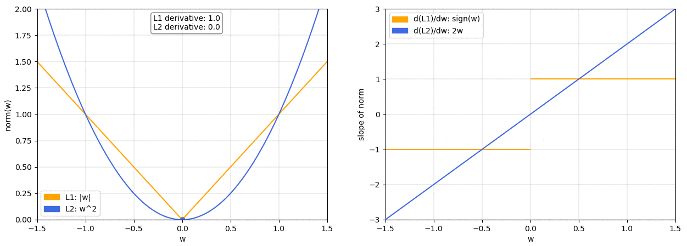

#### [towardsdatascience](https://towardsdatascience.com/visualizing-regularization-and-the-l1-and-l2-norms-d962aa769932)

On the left we have a plot of the L1 and L2 norm for a given weight w. On the right, we have the corresponding graph for the slope of the norms. As we can see, both L1 and L2 increase for increasing asbolute values of w. However, while the L1 norm increases at a constant rate, the L2 norm increases exponentially.

This is important because, as we know, when doing gradiant descent we’ll update our weights based on the derivative of the loss function. So if we’ve included a norm in our loss function, the derivative of the norm will determine how the weights get updated.

We can see that with the L2 norm as w gets smaller so does the slope of the norm, meaning that the updates will also become smaller and smaller. When the weights are close to 0 the updates will have become so small as to be almost negligible, so it’s unlikely that the weights will ever become 0.

On the other hand, with the L1 norm the slope is constant. This means that as w gets smaller the updates don’t change, so we keep getting the same “reward” for making the weights smaller. Therefore, the L1 norm is much more likely to reduce some weights to 0.

#### [Kaggle](https://www.kaggle.com/residentmario/l1-norms-versus-l2-norms)

Robustness: L1 > L2

Robustness is defined as resistance to outliers in a dataset. The more able a model is to ignore extreme values in the data, the more robust it is.

The L1 norm is more robust than the L2 norm, for fairly obvious reasons: the L2 norm squares values, so it increases the cost of outliers exponentially; the L1 norm only takes the absolute value, so it considers them linearly.

Stability: L2 > L1

Stability is defined as resistance to horizontal adjustments. This is the perpendicular opposite of robustness.

The L2 norm is more stable than the L1 norm. A later notebook will explore why.

Solution numeracy: L2 one, L1 many

Because L2 is Euclidean distance, there is always one right answer as to how to get between two points fastest. Because L1 is taxicab distance, there are as many solutions to getting between two points as there are ways of driving between two points in Manhattan! This is best illustrated by the same graphic from earlier:

In terms of regularizer:

Computational difficulty: L2 > L1

L2 has a closed form solution because it's a square of a thing. L1 does not have a closed form solution because it is a non-differenciable piecewise function, as it involves an absolute value. For this reason, L1 is computationally more expensive, as we can't solve it in terms of matrix math, and most rely on approximations (in the lasso case, coordinate descent).

Sparsity: L1 > L2

Sparsity is the property of having coefficients which are highly significant: very near 0 or very not near 0. In theory, the coefficients very near 0 can later be eliminated.

Feature selection is a further-involved form of sparsity: instead of shrinking coefficients near to 0, feature selection is taking them to exactly 0, and hence excluding certain features from the model entirely. Feature selection is a technique moreso than a property: you can do feature selection as an additional step after running a highly sparse model. But lasso regression is interesting in that it features inbuilt feature selection, while ridge regression is just very sparse.
