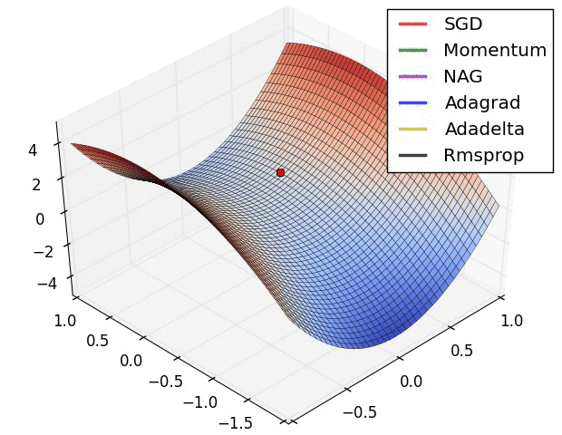

Main reference [Sebastian Ruder' blog](https://ruder.io/optimizing-gradient-descent/index.html)

Other refs: [CS231n-stochastic-gradient-descent](https://cs231n.github.io/optimization-1/), [CS231n-setting-up-the-architecture](https://cs231n.github.io/neural-networks-1/), [CS231n-setting-up-the-data-and-the-loss](https://cs231n.github.io/neural-networks-2/), [CS231n-learning-and-evaluation](https://cs231n.github.io/neural-networks-3/).

## Gradient Descent
#### Batch Gradient Descent
A.k.a Vanilla gradient descent. 

*θ = θ - η * ∇_θ J(θ, entire_dataset)*.
```python
# psuedo code for one epoch training
jacobian = compute_gradient(loss_function, params, entire_training_dataset)
params = params - learning_rate * jacobian
```

<u>Pros</u>: it is guaranteed to converge to the global minimum for convex error surfaces and to a local minimum for non-convex surfaces;

<u>Cons</u>: it can be very slow (huge computation cost in computing the jacobian using the entire dataset and redundant computation for similar examples in a large dataset) and intractable for datasets that don't fit in memory. Batch gradient descent is not capable of handling new examples during training either.

#### Stochastic Gradient Descent
Perform a training parameters update using ONLY 1 training example for each training step.

*θ = θ - η * ∇_θ J(θ, single_data)*
```python
# psuedo code for one epoch training
shuffled_training_data = random.shuffle(training_dataset)
for single_training_data in range(shuffled_training_data):
    jacobian = compute_gradient(loss_function, params, single_training_data)
    params = params - learning_rate * jacobian
```

<u>Pros</u>: Usually it is much faster than Batch Gradient Descent, and it enables the training process to jump to a new and possibly a better local minima; 

<u>Cons</u>: The loss function is always highly fluctuated, and ultimately complicates the training convergence as it sometimes overshoots.

P.S. why shuffle the dataset in each training epoch:

#### Mini-Batch Gradient Descent
A combination of Batch gradient descent and Stochastic gradient descent and it performs a training parameters update using n training examples out of N total examples for each training step.

*θ = θ - η * ∇_θ J(θ, batch_data)*
```python
# psuedo code for one epoch training
shuffled_training_data = random.shuffle(training_dataset)
dataset_size = sizeof(training_dataset)
batch_size = n
for i in range(dataset_size/batch_size + 1):
    batched_training_data = shuffled_training_data[i*batch_size:(i+1)*batch_size]
    jacobian = compute_gradient(loss_function, params, batched_training_data)
    params = params - learning_rate * jacobian
```

More stable convergence behaviours compared to Stochastic gradient descent and more efficient gradient computation compared to Batch gradient descent. Thus it is most used in training neural networks.

<u>Challenges to solve:</u> how to best choose learning parameters, i.e. learning rate, and how to jump out of the local minima for non-convex loss function.

## Modern Variants

#### Momentum
Prevent the SGD from oscillating by adding a weighted previous descent step.

*v_t = γ * v_(t-1) + η * ∇_θ J(θ, batch_data)*

*θ = θ - v_t*

Usually *γ* is set to 0.9.


 

#### Nesterov accelerated gradient (NAG)
In addition to Momentum, which prevents the oscillation, Nesterov accelerated gradient approximates the next position of the parameters *(θ - γ * v_(t-1))* and computes gradients on the estimated next position instead of the current position.

*θ_est = θ - γ * v_(t-1)*

*v_t = γ * v_(t-1) + η * ∇_θ J(θ_est, batch_data)*

*θ = θ - v_t*


e.g. 
Momentum first computes the current gradient (small blue vector) and then takes a big jump in the direction of the updated accumulated gradient (big blue vector). 
NAG first makes a big jump in the direction of the previous accumulated gradient (brown vector), measures the gradient and then makes a correction (red vector), which results in the complete NAG update (green vector). This anticipatory update prevents us from going too fast and results in increased responsiveness.

P.S. This can significantly increase the performance of RNNs on a number of tasks.

#### Adagrad
Adaptive learning rate of each parameter components for gradient descent: smaller updates (i.e. low learning rates) for parameters associated with frequently occurring features, and larger updates (i.e. high learning rates) for parameters associated with infrequent features. Very useful for **sparse data**.


*G_t*  is a diagonal matrix where each diagonal element *(i, i)* is the sum of the squares of the gradients w.r.t. θ_i UP TO time step t, while ϵ is a smoothing term that avoids division by zero (usually on the order of 1*e^(−8)).

<u>Pros</u>: it eliminates the need to manually tune the learning rate. Most implementations use a default value of 0.01.

<u>Cons</u>: its accumulation of the squared gradients in the denominator keeps growing during training, causing the learning rate to shrink and eventually beconme infinitesimally small, at which point the algorithm is no longer able to acquire additional knowledge. 

#### Adadelta
It's an improved version of Adagrad, preventing the <u>aggressive, monotonically decreasing behaviour of the learning rate</u>. It is done by replacing the Diagonal matrix *G_t* with the decaying average over past squared gradients *E[g^2]_t*. Then to solve the <u>unit not matched</u> issue, the learning rate η is replaced with the RMS[Δθ]_(t−1).


<u>Pros</u>: it eliminates the need to set default learning rate.

#### RMSprop
Adaptive learning rate method proposed by Geoff Hinton with the purpose of solving the Adagrad's radically diminishing learning rates issue. Identical to the first part of Adadelta.
Hinton suggests γ to be set to 0.9, while a good default value for the learning rate η is 0.001.


#### Adam
Adaptive Moment Estimation (Adam) is another method that computes adaptive learning rates for each parameter. 
It estimates the first momentum and second momentum as the decaying average of past gradients and past squared gradients respectively as follow:


Then the Adam update rule is:


The authors propose default values of 0.9 for β_1, 0.999 for β_2, and 10^−8 for ϵ.

Adam配置参数 in pytorch:
  * alpha:   也被称为学习速率或步长。权重比例被校正(例如001)。更大的值(例如0.3)在速率校正之前会加快初始学习速度。较小的值(例如1.0e-5)在培训期间降低学习速度
  * beta1:   第一次估计的指数衰减率(如9)。
  * beta2:   第二次估计的指数衰次减率(例如999)。在稀疏梯度问题(例如NLP和计算机视觉问题)上，这个值应该接近1.0。
  * epsilon: 是一个非常小的数字，可以防止任何在实施中被0划分(例如，10e-8)。

<!-- #### AdaMax -->

<!-- #### Nadam -->

<!-- #### AMSGradMomentum -->

#### Visualisation Examples
GIF credits to [Alec Radford](https://twitter.com/alecrad)



