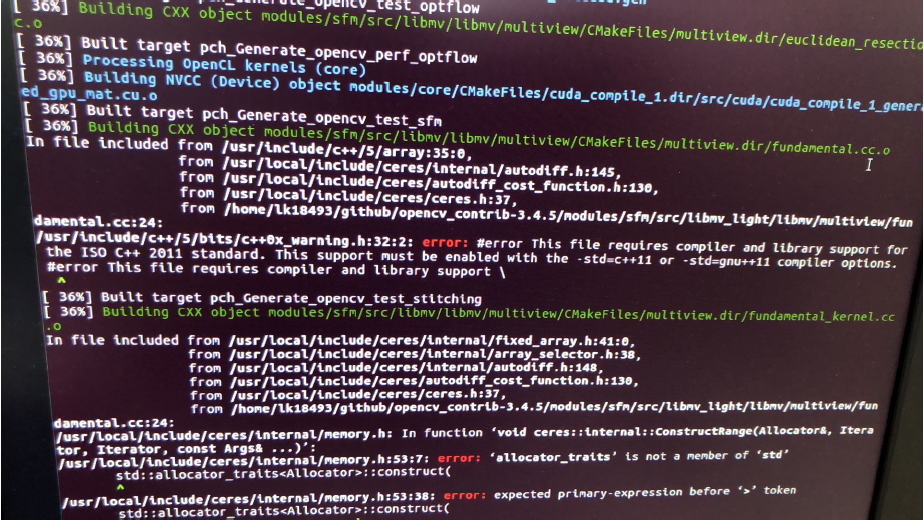

# Random notes in CMake

### c++ `ERROR: ISO c++11 standard`


在CMakeLists.txt中加入一行`set(CMAKE_CXX_STANDARD 11)`。

e.g. 在编译opencv时出这个错，就在opencv的主文件夹中的CMakeLists.txt里加入`set(CMAKE_CXX_STANDARD 11)`


### OpenCV `undefined reference to TIFFReadRGBAStrip@LIBTIFF_4.0`
[solution link](https://blog.csdn.net/Chris_zhangrx/article/details/85245610)
按上述方法做虽然在编译opencv时没有问题了，但是再编译SLAM程序时，同样的问题会再次出现。

Possible reason: opencv在编译时与系统内的libtiff link但是在跑SLAM时又需要与Anaconda的libtiff link
解决办法：编译opencv时将它指向Anaconda的libtiff，i.e. 先启动Anaconda虚拟环境，再编译OpenCV

编译时使用以下命令
`cmake -DCMAKE_INSTALL_PREFIX=/usr/local -DWITH_CUDA=ON -`
`DOPENCV_EXTRA_MODULES_PATH=../../opencv_contrib-3.4.5/modules -`
`DBUILD_TIFF=ON -DOPENCV_ENABLE_NONFREE:BOOL=ON ..`

(也有可能是因为多加了 "-DBUILD_TIFF=ON" 命令而导致该错误被避免了 )


### OpenCV `The algorithm is patented and is excluded`
When compiling OpenCV: use the extra command `-DOPENCV_ENABLE_NONFREE:BOOL=ON`

e.g.
```shell
cmake -DCMAKE_INSTALL_PREFIX=/usr/local -DWITH_CUDA=ON -
DOPENCV_EXTRA_MODULES_PATH=../../opencv_contrib-3.4.5/modules -DBUILD_TIFF=ON -
DOPENCV_ENABLE_NONFREE:BOOL=ON ..
```

Then in the cmake output you will see:
...
Applications: test perf_tests apps
Documentation: NO
Non-free algorithms: YES
...


### ceres `‘integer_sequence’ is not a member of ‘std‘`
[solution link](https://blog.csdn.net/qq_41586768/article/details/107541917)