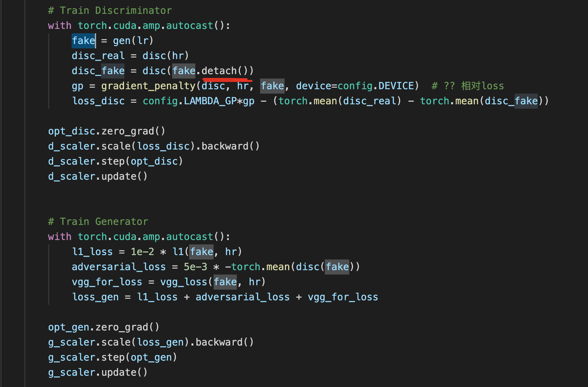

# PyTorch-Notes

#### Posts
##### Some errors
concatenate variable; 
tensors are on different GPUs; 
argument 0 is not a Variable; 
backward through the graph a second time; 
multi-target not supported at.
[Link](https://zhuanlan.zhihu.com/p/47749934)

##### Running Out Of Memory Error
Reasons could be batch size too big.
[Link](https://discuss.pytorch.org/t/backward-to-compute-partial-derivatives-without-retain-graph-true/74364/6)


#### HTTPError
`urllib.error.HTTPError: HTTP Error 403: rate limit exceeded` when using `resnet = torch.hub.load("facebookresearch/WSL-Images", "resnext101_32x8d_wsl")`
[ref](https://stackoverflow.com/questions/68901236/urllib-error-httperror-http-error-403-rate-limit-exceeded-when-loading-resnet1)
This is a bug in Pytorch 1.9. As a workaround, try adding:
`torch.hub._validate_not_a_forked_repo=lambda a,b,c: True`
to your script before any torch.hub call. i.e.:
```python
torch.hub._validate_not_a_forked_repo=lambda a,b,c: True
model = torch.hub.load('pytorch/vision:v0.9.0', 'resnet18', pretrained=True)
```

#### RuntimeError
`RuntimeError: Trying to backward through the graph a second time, but the saved intermediate results have already been freed. Specify retain_graph=True when calling .backward() or autograd.grad() the first time.` 
训练GAN net时经常遇到这个问题. 翻译一下就是 第二次尝试在图中向后遍历时，保存的临时变量已经被释放. 显然，
GAN中有一个变量存在于gen和disc之间，就是fake，加上detach() 就行. 

Same for the Implicit-Localisation Model. 
In the second pass, a new variable is added to the model, which is the vps[0]. Detach this vairable before backwards.


#### `torch.no_grad()`
The wrapper `with torch.no_grad()` sets all of tehe `requires_grad` flags to false.
The PyTorch official document for `autograd` is [here](https://pytorch.org/tutorials/beginner/blitz/autograd_tutorial.html). 

In short, if a tensor has the flag `requires_grad` set to `True`, then `autograd` tracks every operation on this tensor.
"In a NN, parameters that don’t compute gradients are usually called frozen parameters. It is useful to “freeze” part of your model if you know in advance that you won’t need the gradients of those parameters (this offers some performance benefits by reducing autograd computations)."

#### `tensor.detach()`
This code creates a new tensor that shares storage with tensor that does not require grad. It remove the tensor from the computation graph. The returned tensor will never require gradient.
*Difference to `torch.no_grad()`*: 
1. `detach()` only removes one variable from the computation graph while `no_grad()` sets all the `requires_grad` flag within the `with` statement to false. 
1. `torch.no_grad()` uses less memory as it doesn't keep any intermediary results.

#### `@torch.jit.script`
In short, torch.jit can be used to enable 2x-3x speedups on custom module code by making the code execution happen in C++. Details see the blog [here](https://spell.ml/blog/pytorch-jit-YBmYuBEAACgAiv71).

#### `tensor.contiguous()`
It makes a copy of the tensor such that is contiguous in memory. The data stored is the same.
Normally you don't need to worry about this. You're generally safe to assume everything will work, and wait until you get a RuntimeError: input is not contiguous where PyTorch expects a contiguous tensor to add a call to contiguous().

#### `tensor.permute(*dims)`
It rearranges the original tensor according to the desired ordering and returns a **new** multidimensional rotated tensor.

#### `tensor.view(...)`
It creates a new view of the existing tensor while avoids explicit data copy. It is a fast and memory efficient reshaping, slicing and eliment-wise operation.
**-1**: If there is any situation that you don't know how many rows you want but are sure of the number of columns, then you can specify this with a -1. (Note that you can extend this to tensors with more dimensions. *Only one of the axis value can be -1*). This is a way of telling the library: "give me a tensor that has these many columns and you compute the appropriate number of rows that is necessary to make this happen".
Other PyTorch operations that do not change the contents of a tensor but change the way the data is organised: `narrow()`, `expand()` and `transpose()`.
